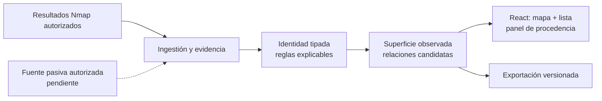

# CHEF

**Evidencia clara para entender una superficie de ataque autorizada.**

CHEF es un proyecto del **Centro Cultural de Ciberseguridad**. Su objetivo es reducir el trabajo manual de reconocimiento: reunir resultados activos y señales pasivas, quitar duplicados sin perder procedencia y mostrar **por qué** dos observaciones se relacionan. Un servicio abierto es una observación; una relación entre fuentes puede ser una inferencia; ninguno de los dos es por sí mismo una vulnerabilidad confirmada.

La visión de producto es una aplicación web para equipos de pentesting: proyectos separados, mapa interactivo y lista accesible, evidencias fechadas, relaciones observadas o candidatas, y exportaciones reproducibles. La [propuesta de arquitectura web](docs/architecture/proposed-web.md) usa React/TypeScript, API TypeScript/Node y PostgreSQL/Prisma. GitHub OAuth, fuentes OSINT y despliegue privado están **propuestos**, todavía no implementados. La integración con Burp Suite vendrá después del producto web.

## Estado verificable

- **Funciona hoy:** núcleo TypeScript con dominio aislado, importador Nmap XML offline, scope literal, identidad determinista, deduplicación conservadora, relaciones con evidencia y exportación `Snapshot 1.0.0` mediante CLI. Los tests incluyen un control negativo que impide fusionar hosts por hostname compartido y entradas XML hostiles.
- **Spike separado:** adaptador Java/Montoya para normalizar requests HTTP seleccionadas. Compila y tiene pruebas de conformidad, pero aún requiere validación manual dentro de Burp y no correlaciona HTTP con Nmap.
- **En propuesta:** UI React, API, PostgreSQL/Prisma, OAuth, fuente pasiva, correlación entre fuentes, mapa/exportación visual y actualización periódica. Ninguno de esos componentes se muestra como entregado por figurar en diagramas o contratos.

La presentación objetivo es el **31 de octubre de 2026**, con diez horas semanales por cada integrante: César, Diego y Jhojan. El prototipo deseado es web desplegado para el equipo, con crear proyecto → importar Nmap autorizado → consultar una fuente pasiva → revisar activos/relaciones con evidencia → exportar. **La fuente pasiva y la capacidad necesaria para completar todo el recorrido siguen abiertas**; el [plan reestimado](docs/proposals/2026-09-scrum-to-oct31.md) explicita el desfase en vez de ocultarlo. En esta fase CHEF **no lanza escaneos**; solo importa resultados autorizados.

## Probar el incremento actual

Requiere Node.js 24 LTS y npm. Los fixtures son sintéticos, usan loopback y no necesitan Nmap, Burp, base de datos ni Internet.

```sh
npm ci
npm run check
npm run demo
```

Para generar un snapshot JSON con la CLI:

```sh
npm run build
node dist/apps/cli/src/main.js fixtures/nmap/lab.xml fixtures/scope/lab.json > chef.json
```

El JSON generado puede contener datos sensibles si se usa evidencia real: no se debe subir al repositorio. El comando lee archivos locales; no dirige tráfico al objetivo. El [contrato versionado](docs/contracts/README.md) documenta campos y semántica.

## Diseño del producto



La idea diferencial es una **hipótesis comprobable**: un analista debería encontrar y explicar un servicio y su relación con una señal pasiva con menos pasos y tiempo que revisando fuentes por separado, sin aumentar falsos enlaces ni perder evidencia. La [investigación de fuentes y algoritmos](docs/research/recon-correlation-2026-09.md) y la [selección de OSINT abierta](docs/research/open-osint-selection.md) comparan opciones, límites temporales y cómo se medirá. “Tiempo real” requerirá latencia, frescura y fallos de actualización medidos; el incremento actual solo se actualiza por ejecución.

## Navegar el repositorio

- [Producto y requisitos](docs/product/prd.md) · [propuesta actual de alcance](docs/proposals/2026-09-scope-decision.md)
- [Arquitectura vigente](docs/architecture/overview.md) · [arquitectura web propuesta](docs/architecture/proposed-web.md) · [ADRs y contratos por reconciliar](docs/proposals/2026-09-adr-contract-deltas.md)
- [Investigación](docs/research/recon-correlation-2026-09.md) · [OSINT abierta](docs/research/open-osint-selection.md) · [fuentes primarias fechadas](docs/research/sources.json)
- [Scrum hasta octubre](docs/proposals/2026-09-scrum-to-oct31.md) · [backlog sugerido](docs/proposals/2026-09-issues.md)
- [Contribuir y revisar PRs](CONTRIBUTING.md) · [CI y CodeQL](docs/governance/ci-security.md) · [índice documental](docs/README.md) · [skills locales](docs/process/skills-usage.md)

El dominio vive en `packages/domain`, los casos de uso en `packages/application`, los adaptadores en `packages/adapters` y la composición actual en `apps/cli`. `apps/api` y `apps/web` reservan fronteras futuras, sin servidores ni UI funcionales. `extensions/burp` contiene el spike separado. Las reglas del equipo están en [AGENTS.md](AGENTS.md).

Código original de CHEF bajo [MIT](LICENSE); [dependencias y límites de redistribución](docs/governance/licenses.md). CHEF no está afiliado ni aprobado por PortSwigger o Nmap. Solo se trabaja con datos y entornos autorizados; un archivo importado nunca amplía el scope.
