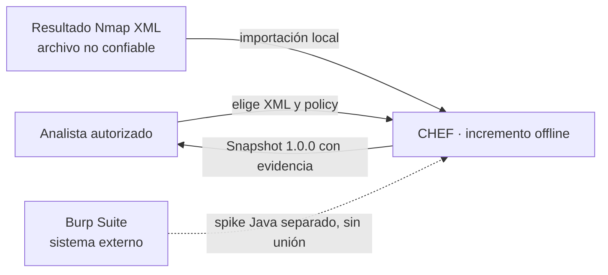
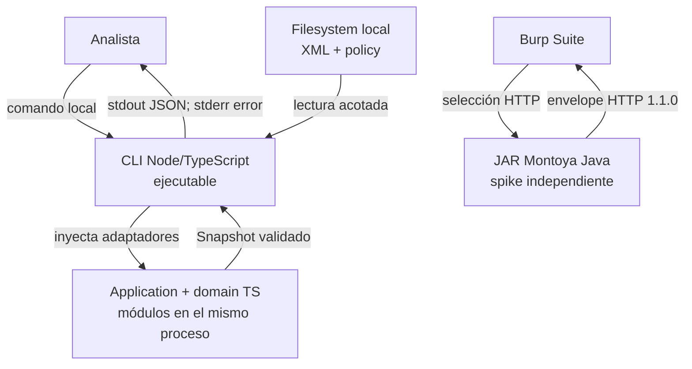
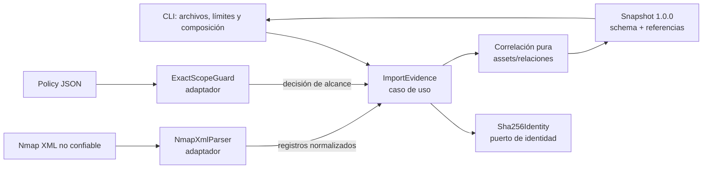

# Arquitectura de CHEF: estado actual y destino propuesto

Fecha 29-09-2026. Este documento describe **lo que existe**; [proposed-web.md](proposed-web.md) describe el destino web y marca cada pieza futura. La separación evita que un diagrama se interprete como entrega. El modelo [C4 oficial](https://c4model.com/diagrams) usa distintos niveles de zoom: contexto (personas/sistemas), contenedores (unidades ejecutables y almacenes) y componentes (responsabilidades dentro de un contenedor). Aquí se muestran los tres niveles útiles, sin confundir carpetas con contenedores.

## Nivel 1 · Contexto del sistema actual

CHEF actual es un proceso local de análisis, no un servicio SaaS. El analista controla el archivo y una allowlist literal de IP/puerto/protocolo; el XML jamás amplía ese scope. No se hacen conexiones al objetivo ni consultas OSINT. El spike Burp se muestra punteado porque no forma parte del flujo de importación del núcleo. Las flechas nombran interacciones y las cajas describen quién las controla.

## Nivel 2 · Contenedores actuales

El core es una agrupación lógica **dentro del proceso Node**, no un servidor separado. El JAR Java vive en el proceso Burp y comparte fixtures/contratos, no imports TypeScript. `apps/api` y `apps/web` reservan responsabilidades pero no ejecutan servidores; PostgreSQL/Prisma, OAuth y proveedores OSINT tampoco existen en el incremento actual. No incluirlos como contenedores implementados. El destino propuesto y despliegue Vercel/Railway están [dibujados aparte](proposed-web.md).

## Nivel 3 · Componentes del proceso Node

La dependencia de código va desde CLI/adaptadores a casos de uso y dominio; el dominio no importa filesystem, red, React, Prisma ni Montoya. `ImportEvidence` recibe parser, guard, identidad y reloj por interfaces estrechas. El parser produce registros; no decide propiedad de activos ni persiste. El guard decide scope; la correlación crea IDs deterministas y conserva cada observación. La CLI publica JSON solo después de validarlo: un error deja stderr y ningún snapshot parcial. [SOLID](solid.md) y `npm run check:architecture` verifican dirección de imports, pero una revisión humana sigue siendo necesaria para responsabilidades semánticas.

## Fronteras de confianza e invariantes

1. **Archivo→parser:** bytes/XML son no confiables. CLI limita tamaño; parser rechaza DTD/entidades externas, profundidad y estructuras no soportadas. [CWE-611](https://cwe.mitre.org/data/definitions/611.html) y [CWE-400](https://cwe.mitre.org/data/definitions/400.html) orientan los controles; los fixtures hostiles son prueba, no garantía universal.
2. **Policy→scope:** solo IP/puerto/protocolo literales aprobados; exclusiones prevalecen. Ni un hostname en XML ni un proveedor OSINT pueden crear scope. El guard falla cerrado.
3. **Observación→inferencia:** evidencia tiene digest/locator/run; una relación guarda las observaciones que la sostienen. Un hash identifica contenido, no autentica origen. Hostname compartido no fusiona hosts; un servicio abierto no implica vulnerabilidad. `observed` e `inferred` son distintas aserciones.
4. **Snapshot→consumidor:** esquema y versión se validan antes de exportar; cualquier lector externo futuro también debe comprobar referencias únicas y existentes. UI no debe ejecutar HTML ni navegar URLs del dato importado ([CWE-79](https://cwe.mitre.org/data/definitions/79.html)).
5. **Futuro navegador/API/DB:** autenticación, membresía de proyecto, tamaño de carga, SSRF y exportación son fronteras nuevas aún sin implementar. La [matriz CWE](../security/cwe-controls.md) y la [arquitectura propuesta](proposed-web.md) especifican gates.

## Cualidades y decisiones pendientes

**Correctitud:** mismo input + policy + reloj fijo producen IDs estables; control negativo impide merge débil. **Auditabilidad:** toda relación navegable hasta observación y evidence. **Disponibilidad:** límites de 2 MiB/10 000 registros/profundidad 32 según [amenazas](../security/threat-model.md); la cancelación síncrona tiene límite conocido y no se vende como cancelación interactiva. **Portabilidad:** el dominio es puro, pero adaptadores y schema loading usan Node; web ejecutará el caso de uso en servidor. **Evolución:** nuevos formatos entran por adaptadores y contratos versionados; PostgreSQL por puerto de repositorio, React por DTO de lectura. No introducir microservicios, Neo4j, SSE o motor probabilístico sin métrica que los justifique.

Los [ADRs](../adr/README.md) registran decisiones y supersesiones; la [matriz de reconciliación](../proposals/2026-09-adr-contract-deltas.md) explica la nueva prioridad web. El [modelo de amenazas](../security/threat-model.md) y [estándares](../governance/standards.md) completan los requisitos de calidad. El código, las pruebas y los contratos publicados prevalecen sobre un diagrama si discrepan; se abre issue/ADR para resolver la diferencia.
