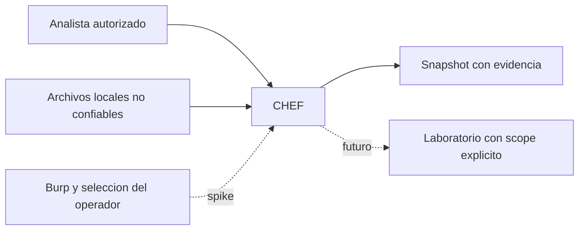
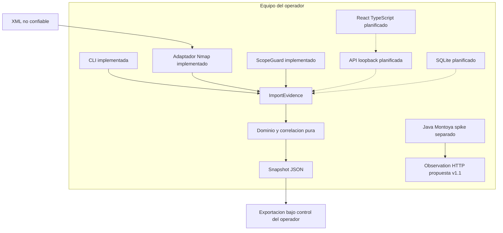

# Arquitectura

Arquitectura de puertos y adaptadores con un monolito modular pequeño. C4 contexto representa el producto objetivo; contenedores punteados/indicados como plan todavía no existen. El núcleo actual funciona únicamente mediante CLI offline.

## Flujo actual y confianza

CLI abre archivo regular y lee como máximo límite+1 bytes. Schema valida scope; normaliza IPv6. Parser convierte UTF-8/XML a registros, bloquea DTD externo/entidades y rechaza campos fuera de contrato. Application comprueba límites/cancelación y cada registro contra scope antes de crear snapshot. Correlación produce IDs deterministas y fusiona evidencias sin eliminar observaciones. CLI valida schema de salida y exporta sin almacenar raw ni hacer red.

Fronteras: filesystem/XML → adaptador; adaptador → dominio; JSON → futuro frontend; HTTP no confiable → Montoya. El hecho de que una request esté en Burp no hace confiable su contenido. Un hash identifica bytes; no prueba autenticidad del emisor.

## Evolución

Workers para parsing pesado/cancelación; puerto de repositorio para SQLite transaccional; API loopback autenticada para sesiones; SSE para diffs versionados; React aplica snapshots/diffs. Añadir estas piezas solo con historias y gates. No introducir microservicios, Neo4j ni un scheduler complejo para una demo de tres estudiantes.

La frontera Montoya comparte formatos/golden fixtures, no imports del core. Un subset Java duplica una implementación pequeña, pero obliga a pruebas de conformidad para impedir drift semántico.
