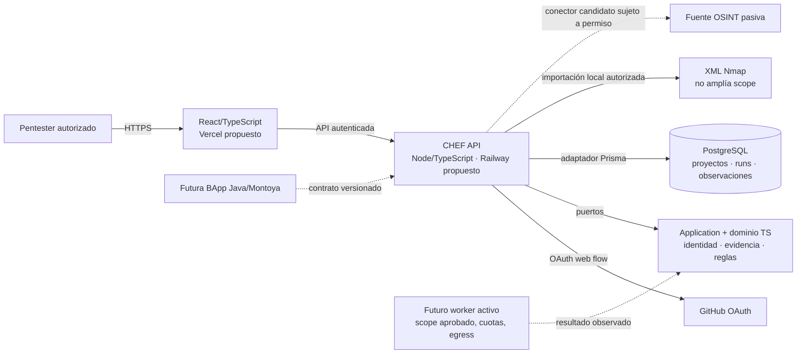
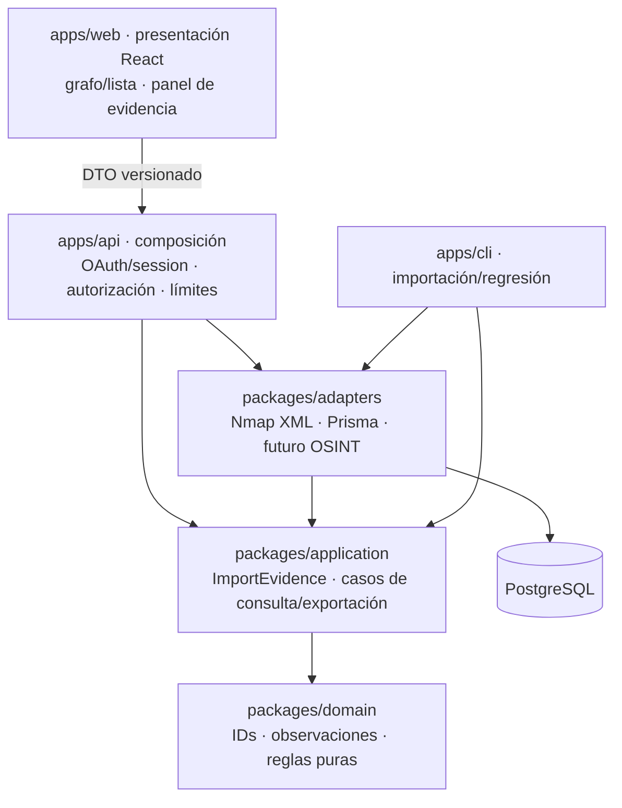
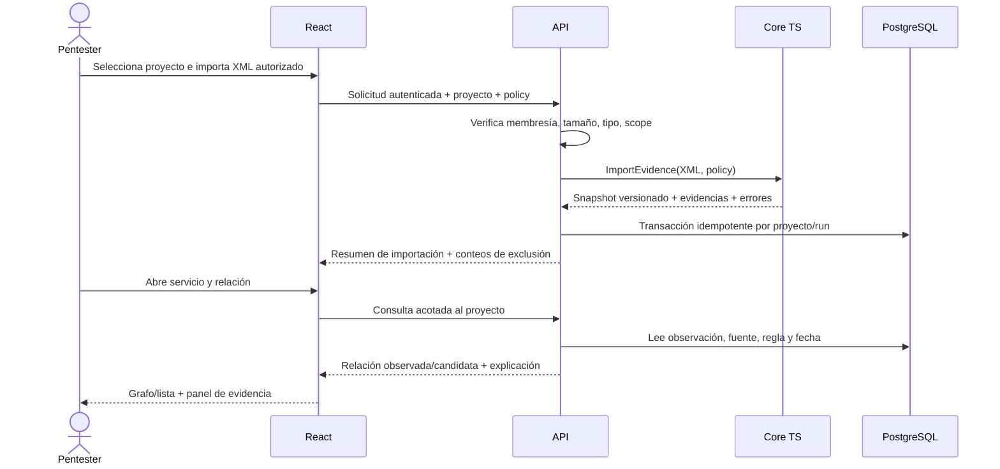

# Arquitectura propuesta de CHEF web

Fecha 29-09-2026. **Propuesta para revisión, no arquitectura implementada.** El diseño de referencia usa React/TypeScript, API Node/TypeScript y PostgreSQL/Prisma; reutiliza el núcleo actual. Responde a la [decisión de producto](../proposals/2026-09-scope-decision.md) y a la [investigación](../research/recon-correlation-2026-09.md). Backend Go queda como alternativa evaluada: exigiría puente o reimplementación y no usaría de forma sostenible Prisma Go, que [anuncia deprecación](https://github.com/prisma/prisma-client-go). La decisión final del propietario/equipo se registrará en ADR.

## Contexto y límites de confianza

Fronteras: navegador no recibe secretos de proveedor ni acceso directo a PostgreSQL; API valida identidad, membresía, tamaño, formato y scope; adaptadores tratan XML/OSINT como no confiables; dominio no conoce HTTP, base, React ni Burp. La fuente externa y worker activo son **propuestos**, no disponibles hoy. El importador Nmap y el core TS sí existen; API/web/DB no.

## Contenedores y dependencias

La dirección lógica de dependencias es hacia dominio/application. El adaptador Prisma implementa puertos definidos por casos de uso. El motor de correlación no se replica en React ni se delega a consultas ad hoc. HTTP expone DTO de lectura; `Snapshot 1.0.0` sigue como formato de exportación/intercambio, no como modelo ORM. Añadir observaciones pasivas al wire requiere nueva versión/esquema/ejemplo/prueba/nota de compatibilidad. El diseño sigue SOLID al separar política de alcance, parsing, identidad, repositorio y presentación en componentes intercambiables.

## Flujo de la primera vertical

Cuando exista una fuente pasiva autorizada, su adaptador crea observaciones independientes con locator, tiempo, términos de origen y estado de actualización. El motor compara claves tipadas y contexto temporal; una coincidencia débil permanece candidata. La importación no invoca Nmap ni dirige tráfico al objetivo. Cada ejecución guarda regla/parser/versiones para reproducir el enlace.

## Acceso a datos y multiusuario

Modelo lógico propuesto: `User` ↔ `Membership` ↔ `Project`; dentro de proyecto `ScopePolicy`, `Source`, `ImportRun`, `Evidence`, `Observation`, `Entity`, `RelationAssertion`, `ReviewDecision`, `Export`. `projectId` y constraints de integridad están en toda entidad de proyecto; consultas/actualizaciones se autorizan por membresía y acción. RLS de [PostgreSQL](https://www.postgresql.org/docs/current/ddl-rowsecurity.html) puede ser defensa adicional tras prueba de contexto por conexión. El dueño de tabla no está sujeto por defecto a políticas RLS: configurar roles de ejecución con cuidado. La API jamás confía en un `projectId` enviado por cliente sin comprobar pertenencia. Exportaciones y objetos temporales también se acotan. GitHub OAuth solo prueba identidad; no concede permisos de proyecto.

Persistir metadata de evidencia y política de retención; decidir si el XML original se guarda cifrado o no se retiene. Hashes de archivos permiten integridad local, no autenticidad ni anonimización. Definir backup/restore, borrado, migraciones reversibles y logs sin payload sensible antes de publicar. [Prisma/PostgreSQL](https://www.prisma.io/docs/prisma-orm/quickstart/postgresql) es la interfaz elegida por el propietario; fijar versión estable en PR de implementación.

## Contrato de explicación y visualización

Un `RelationView` necesita entidad izquierda/derecha tipada, estado `observed|inferred|candidate|conflicted`, `ruleId` y versión, evidencias a favor/en contra, fechas por fuente, frescura y motivo de exclusión de alternativas. La API decide identidad y fusión; React presenta y filtra. Un mapa descargable tiene **dos productos distintos**: exportación de datos versionada (JSON/schema/manifest) para reproducir, e imagen SVG/PNG de la vista filtrada para informe; se deben probar contra inyección y pérdida de evidencia. HTML interactivo autónomo queda posterior y requiere revisión de seguridad. El grafo siempre tiene lista accesible equivalente y el panel no interpreta HTML importado.

## Calidad, operación y gates

1. Core/CLI existente: tests de regresión, IDs, control negativo, scope y `npm run check`.
2. API/DB: dos proyectos y dos usuarios, pruebas IDOR, transacción atómica, idempotencia, límites de importación, autorización de export, migración/rollback.
3. Conector pasivo: permiso, cuota, provenance, fixture, error/redacción/frescura, cero resultados inventados.
4. Correlación: corpus etiquetado, falsos enlaces y contradicciones, reproducibilidad por versión de regla; no afirmar vulnerabilidad confirmada.
5. UI: teclado, lista equivalente, contraste, estados vacío/error, test end-to-end del recorrido y medición con usuarios.
6. Despliegue privado: secretos, OAuth callback, aislamiento, backups/restore, observabilidad sin datos sensibles y runbook. Acceso a [Vercel](https://vercel.com/docs/frameworks/frontend/vite)/[Railway](https://docs.railway.com/guides/saas-backend) no implica despliegue probado.

Escalado posterior: medición antes de colas, SSE o cache; solo añadir worker y actualización continua cuando proveedor, licencia, latencia y operación estén definidos. Un worker activo exige alcance aprobado y controles de egress. Burp se integra después con contrato y fixtures de conformidad Java/TS; su validación manual/criterios siguen separados.
