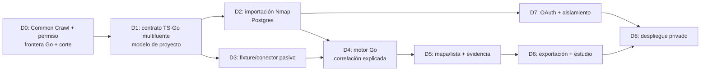

# Scrum reestimado hasta el 31 de octubre

Fecha 29-09-2026. **Propuesta, aún no compromiso del equipo.** El propietario confirmó un **prototipo web desplegado para el equipo**, demostrable en vivo, React/TypeScript, **API Node.js con PostgreSQL/Prisma y GitHub OAuth, motor de correlación Go**, importación de resultados autorizados y **ningún escaneo lanzado por CHEF**. Nmap XML está disponible; Common Crawl fue elegido como primer conector candidato, pero permiso, acceso y dataset correspondiente aún no. Hay acceso a Vercel/Railway, no presupuesto ni servicios preparados. La frontera y migración siguen en revisión técnica según [ADR 0011](../adr/0011-node-go-boundary.md). Burp queda después. La [decisión](2026-09-scope-decision.md) y [selección OSINT](../research/open-osint-selection.md) explican costes y límites.

## Objetivo, capacidad y recorte honesto

Recorrido deseado: entrar con GitHub → crear proyecto → importar Nmap → consultar fuente pasiva → correlacionar en Go → revisar activos, enlaces y evidencia fechada → exportar. **No existe todavía** este recorrido integrado. Para el 31-10 quedan unas 137 h brutas (10 h/semana por cada uno de César, Diego y Jhojan); 25 % de reserva deja ~103 h netas. Una vertical local estimada antes de Go en 110–160 h y despliegue privado/OAuth en 70–120 h adicionales ya excedían ese presupuesto; contrato, build y conformidad Go **aún no están estimados**. Ningún calendario puede convertirlos en Done por declararlos. El equipo debe aumentar horas, prolongar fecha o acordar recorte. Hasta entonces los sprints siguientes son **objetivos de aprendizaje y gates**, con trabajo máximo de ~100 h netas; no promesa de toda la demo deseada.

**Ruta crítica propuesta para octubre:** mantener core/CLI estable, validar contrato/transporte Go, construir API/DB/React con fixture Nmap, un segundo fixture pasivo autorizado o sintético claramente marcado, correlación Go explicada y exportación. Si no se confirma fuente pasiva antes del 05-10, no contar “consulta OSINT viva” ni medir ahorro real multifuente. GitHub OAuth y despliegue privado son gate separado que requieren prueba de sesión, aislamiento y recuperación; si no caben, la web local se demuestra con datos sintéticos y se informa explícitamente. El propietario puede priorizar otro corte tras reestimar.

## Sprint 1 · 29-09 a 05-10 · decisión y primer slice (24 h)

- **César, 8 h:** revisar ADR 0011 con Diego/Jhojan, spike de invocación Node–Go con fixture y límites, modelo proyecto/run/observación y contrato API mínimo; si Go no está disponible, registrar bloqueo. Reviewer Diego.
- **Diego, 8 h:** prototipo React de proyecto, carga y vista de evidencia con grafo/lista accesibles; prueba de comprensión con el fixture Nmap. Reviewer César.
- **Jhojan, 8 h:** verificar términos/acceso de Common Crawl y dominio autorizado; fixture pasivo de laboratorio **solo si se valida permiso**, o sintético rotulado; golden Nmap y negativos. Reviewer César.
- **Gate:** fuente pasiva, corte de demo, contrato/transporte Go y coste medido; el stack está confirmado, su integración no. Si faltan, reajustar historias antes de implementar conector.

## Sprint 2 · 06-10 a 12-10 · persistir importación (24 h)

- **César, 8 h:** adaptador PostgreSQL/Prisma bajo puerto de aplicación, migración revisada, prueba de aislamiento entre dos proyectos. Reviewer Jhojan.
- **Diego, 8 h:** flujo de importación/estado y vista de servicio con cadena observación→evidencia; manejo de archivo inválido y estado vacío. Reviewer César.
- **Jhojan, 8 h:** pruebas de idempotencia, duplicado Nmap, `open|filtered`, hostname compartido y rechazo atómico. Reviewer Diego.
- **Incremento verificable:** un fixture Nmap importado se consulta desde web local y conserva la misma identidad del core.

## Sprint 3 · 13-10 a 19-10 · primer enlace multifuente (24 h)

- **César, 8 h:** primer slice Go de regla fuerte/candidata y explicación con fixtures TS/Go y falso enlace; no fusionar por hostname/IP compartida. Si 8 h no alcanzan, cerrar solo contrato y control negativo, dejando motor incompleto visible. Reviewer Jhojan.
- **Diego, 8 h:** panel de relación y evidencia fechada, filtros observado/candidato/conflicto, lista equivalente al grafo. Reviewer César.
- **Jhojan, 8 h:** adaptador pasivo del formato autorizado, o importador de fixture sintético; tests positivos/negativos y conteo de observaciones excluidas. Reviewer Diego.
- **Incremento verificable:** un servicio Nmap y una señal pasiva del mismo dominio/IP se muestran con evidencias y fechas; las coincidencias débiles siguen candidatas. Sin fuente real, se presenta como simulación controlada.

## Sprint 4 · 20-10 a 30-10 · gate de despliegue y medición (28 h)

- **César, 9 h:** revisión de GitHub OAuth/roles, separación de proyectos, migraciones, secretos y despliegue Railway **si el corte elegido y tiempo lo permiten**. Si no, seguridad del corte local y deuda escrita. Reviewer Diego.
- **Diego, 10 h:** guion y diseño final, accesibilidad, exportación desde UI, comparación de pasos/tiempo con revisión manual. Reviewer Jhojan.
- **Jhojan, 9 h:** golden/export, fallos hostiles, ensayo reproducible, fuente/permiso y verificación de no escaneo. Reviewer César.
- **Gate final:** solo declarar desplegado/multiusuario si OAuth, permisos, aislamiento, backups y runbook se probaron en el servicio real. Registrar ensayos y resultados sin fabricar usuarios ni tiempos.

Total planificado **100 h netas**; quedan ~3 h de margen adicional sobre la reserva del 25 %. Algunas tareas están dimensionadas al mínimo y dependen de decisiones externas. Si aparece trabajo oculto, recortar visualización avanzada, consulta OSINT viva o despliegue; jamás controles de scope, procedencia, permisos o pruebas de aislamiento. El [Scrum Guide](https://scrumguides.org/scrum-guide.html) exige incremento utilizable y Definition of Done; la review puede cambiar el backlog, no transformar pendientes en terminados.

## Responsabilidades y traspasos

**César — producto técnico, API Node y motor Go.** Responsable de revisar y documentar la frontera elegida, composición de la API, puertos de application, PostgreSQL/Prisma, autorización por proyecto, reglas Go y contrato de exportación. No concentra revisión de todo: Diego revisa el contrato/API desde el uso real; Jhojan revisa fixtures, negativos y preservación del parser. César decide prioridad de backlog como Product Owner, pero no declara una historia Done sin evidencia y review.

**Diego — frontend y experiencia de análisis.** Responsable de React/TypeScript, arquitectura de información, grafo y lista accesible, panel de procedencia, estados vacíos/error, exportación en UI y protocolo de evaluación con pentesters. César revisa que el cliente no replique reglas ni filtre proyectos; Jhojan verifica contenido del fixture y evidencia. La belleza visual se evalúa con tareas: encontrar un servicio, distinguir candidato de observado y explicar una relación; no con un mockup aislado.

**Jhojan — ingestión, fixtures y calidad del dato.** Responsable de conservar Nmap/CLI, construir fixture pasivo y su adaptador tras verificar permiso, deduplicación auditable, casos hostiles, golden y benchmark. César revisa identidad/contrato y Diego comprueba que las exclusiones/contradicciones se puedan mostrar. Jhojan no queda solo frente a decisiones de infraestructura, OAuth o autorización de red: se hace pairing y review.

Todos participan en planning, review, retrospectiva y ensayo. El máximo trabajo en progreso es una historia en implementación por persona y dos PRs pendientes de review para todo el equipo. Cuando la cola de review está llena, se revisa antes de abrir trabajo nuevo. No se inventan cuentas GitHub para asignaciones; owner nominal y login se vinculan cuando el equipo lo confirme.

## Secuencia de dependencia y evidencias

**D0, 05-10:** registrar fuente pasiva concreta, acceso, términos, coste y permiso; declarar si el prototipo privado desplegado sigue viable. Sin fuente, D3 usa fixture sintético declarado y se pospone claim de OSINT real. **D1, 12-10:** contrato de observación/relación con fuente, tiempo, regla, estado y compatibilidad; si no está aprobado, no programar UI sobre un DTO imaginario. **D2–D4, 19-10:** dos fuentes en mismo proyecto, exportables, con control negativo que impide falso merge. **D5–D8, 30-10:** experiencia revisable, piloto, despliegue y operación; cada gate registra prueba y responsable. Si D7 falla, no se muestra un despliegue multiusuario como terminado.

La ruta de aceptación de una relación es: Given proyecto con XML Nmap y observación pasiva autorizada del mismo dominio/IP, When el motor compara claves tipadas y tiempos, Then aparece el servicio y la señal enlazados con regla, fecha y dos evidencias; Given hostname compartido o dato pasivo histórico incompatible, When se compara, Then queda candidato/no fusionado y la interfaz explica por qué. El caso negativo es tan importante como el positivo. La ruta de usuario es: Given usuario miembro de proyecto, When crea/importa/revisa/exporta, Then ve solo su proyecto; Given usuario ajeno, When intenta consultar por ID o exportar, Then recibe denegación sin fuga de metadatos.

## Capacidad, estimación y control de alcance

Las horas por sprint de arriba suman 100 h, distribuidas César 33 h, Diego 34 h, Jhojan 33 h, con ~3 h de margen sobre la capacidad neta. Esa distribución **no cubre de forma creíble** el alcance completo: los rangos antiguos de vertical local (110–160 h) y despliegue/OAuth (+70–120 h) **no incluyen aún el contrato/build/conformidad Go**. Las actividades de sprint son rebanadas exploratorias con tiempo máximo, no una promesa de implementación íntegra. Al cerrar D0 el equipo debe seleccionar historias que caben y anotar descartes. Una estimación más ajustada requiere spikes de 2–4 h para fuente pasiva, transporte Go, Prisma/migraciones y OAuth/despliegue; su resultado altera backlog, no la realidad de 10 h/semana.

Orden de recorte para proteger utilidad: (1) eliminar animación/estilo extra y exportación de imagen; conservar JSON/evidencia; (2) diferir filtros/timeline avanzados; (3) reducir a una fuente pasiva reproducible; (4) diferir actualización automática y dejar fecha de última importación; (5) diferir despliegue si no caben seguridad/operación, registrando que **no se cumplió** la meta privada. No recortar aislamiento, scope, evidencia, control negativo ni errores atómicos para sostener la etiqueta “multiusuario”. Si el propietario exige la demo privada completa el 31-10, pedir capacidad adicional concreta o reducir funciones con nueva estimación aceptada; 30 h/semana del equipo no bastan según los rangos actuales.

El tablero usa `Ready / In progress / Review / Blocked / Done`. Cada bloqueo registra fecha, causa, responsable, alternativa y decisión. Riesgos visibles: acceso/permiso de Common Crawl no confirmados; no hay dataset multifuente con verdad de referencia; hosting sin presupuesto/backup; OAuth y autorización introducen IDOR; frontera Node–Go agrega contrato y operación; diez horas semanales pueden variar por exámenes/ausencias. Una reserva del 25 % cubre integración/contingencias normales, no resuelve un déficit de ~80 h o más.

## Definition of Ready y Definition of Done

Una historia está **Ready** si tiene una persona responsable y otra revisora, objetivo de usuario, fuente autorizada o fixture sintético, contrato/ADR impactado, criterios Given/When/Then positivo y negativo, estimación ≤8 h o división, dependencia resuelta y un modo de verificarla. No se inician a la vez frontend y API sobre campos no acordados: primero se pacta DTO/fixture y se versiona.

Está **Done** solo si compila, pasa pruebas positivas y negativas relevantes, `npm run check`, review humano ajeno a autor, documentación/ADR/schema/ejemplo/compatibilidad al día cuando aplique, ninguna evidencia real en Git, salida reproducible y resultado observado en el entorno declarado. Para UI, prueba teclado/lista y estados vacío/error. Para DB/OAuth, dos proyectos/usuarios y acceso cruzado denegado. Para OSINT, permiso/frescura/cuota/provenance. Para despliegue, URL de equipo, migración, rollback, secretos y recuperación probados. El acta de sprint marca por separado implementado, validado manualmente, bloqueado y propuesto. Las pruebas Montoya dentro de Burp siguen pendientes para su fase posterior.

## Ritmo Scrum, revisión y presentación

Planning semanal de 45 min para elegir objetivo y capacidad real; refinamiento de 30 min a mitad de semana para partir historias; Daily Scrum de hasta 15 min cada día laborable, centrado en bloqueo y siguiente corte verificable según la [pauta diaria](../plan/daily-scrum.md); review de 30 min con incremento ejecutable y evidencia; retro de 20 min con una mejora concreta. Estas reuniones y reviews están incluidas en las 10 h personales; restarlas antes de comprometer horas de implementación. Cada PR enlaza issue, contrato afectado, demo positiva/negativa y reviewer; las ramas se integran al terminar incrementos, evitando una gran fusión el último día.

Antes del 30-10: checkout limpio, `npm ci`, `npm run check`, migración en entorno de demo si existe, fuentes/permiso registrados, usuario piloto, runbook de 5 minutos, exportación recuperable, fallback documentado y al menos dos ensayos con tiempos reales. Congelar el corte el 30-10; el 31-10 enseñar solo rutas efectivamente verificadas. Medir tiempo/pasos CHEF frente a revisión manual con rúbrica previa; si la fuente es sintética, comunicar que el resultado valida interacción/algoritmo bajo laboratorio, no cobertura OSINT real.

## Después de la presentación

El producto web completo permanece como objetivo antes de Burp: completar proveedor pasivo vivo y términos, seguridad/operación multiusuario, historial temporal con frescura medida, exportaciones, estudio con pentesters y conectores adicionales uno por uno. Solo entonces evaluar actualización periódica y, con autorización explícita, jobs activos aislados. La extensión Burp tendrá backlog y validación manual propios. No se asignan fechas posoctubre hasta medir capacidad y resultados de la primera vertical. El [Scrum Guide](https://scrumguides.org/scrum-guide.html) sustenta objetivos de sprint, incremento y Definition of Done; el presente presupuesto es una inferencia específica de CHEF.
